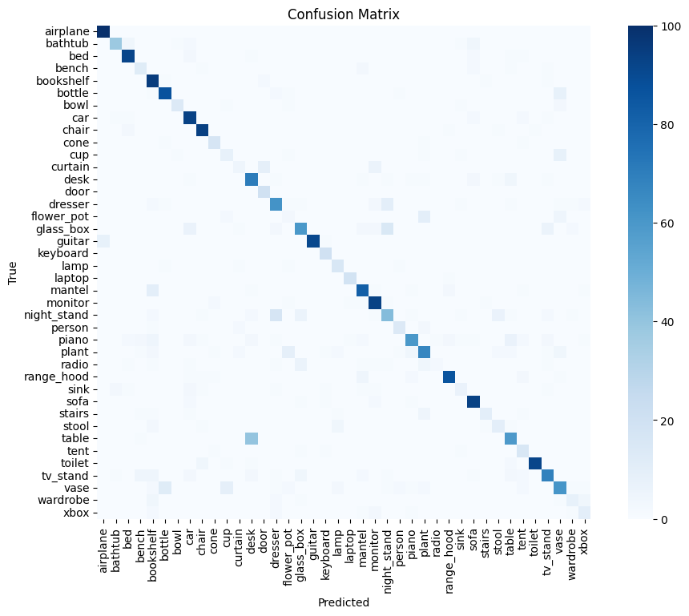

# 3D Neural Networks

Implementation of PointNet, PointNet++, PointCNN, etc. in PyTorch.

## Environment
```
python 3.8.18
torch 2.1.1+cu121
```

Training was done on Tesla V100-PCIE-16GB gpu. But code does support CPU training.

## Datasets
Download the following datasets and place in `data/` directory.
- ModelNet40 from https://modelnet.cs.princeton.edu ModelNet40 Subset.
- ModelNet40_ply_hdf5_2048 from https://shapenet.cs.stanford.edu/media/modelnet40_ply_hdf5_2048.zip
- ShapeNetSubset from https://web.stanford.edu/~ericyi/project_page/part_annotation/index.html, https://shapenet.cs.stanford.edu/ericyi/shapenetcore_partanno_v0.zip (alignment shapenet)
- ModelNet40_Normal_Resampled from https://shapenet.cs.stanford.edu/media/modelnet40_normal_resampled.zip, preprocessed https://drive.google.com/drive/folders/1_fBYbDO3XSdRt3DSbEBe41r5l9YpIGWF?usp=sharing
- TU-Berlin from http://cybertron.cg.tu-berlin.de/eitz/projects/classifysketch/sketches_svg.zip
- Cifar10 from https://www.cs.toronto.edu/~kriz/cifar-10-python.tar.gz
- Mnist from
  - http://yann.lecun.com/exdb/mnist/train-images-idx3-ubyte.gz
  - http://yann.lecun.com/exdb/mnist/train-labels-idx1-ubyte.gz
  - http://yann.lecun.com/exdb/mnist/t10k-images-idx3-ubyte.gz
  - http://yann.lecun.com/exdb/mnist/t10k-labels-idx1-ubyte.gz
- Quickdraw
  - https://raw.githubusercontent.com/googlecreativelab/quickdraw-dataset/master/categories.txt
  - https://storage.googleapis.com/quickdraw_dataset/sketchrnn/ + `<above categories>.npz`
- S3DIS Dataset

### ModelNet40 Normal Resampled
Usage of the dataset can be found at `vis_modelnet40_normal_resampled.ipynb`

| Airplane (2048 Points)  | Airplane (10000 Points) |
| ----------------------- | ----------------------- |
|  |  |


The ModelNet40_ply_hdf5_2048 is similar, just in a different format. Usage can be found at `vis_modelnet40_data.ipynb`.

### ShapeNetSubset
Usage of the dataset can be found at `vis_shapenetcore_partanno_seg_norm.ipynb`

| Airplane (1024)         | Airplane (2466)         |
| ----------------------- | ----------------------- |
|  |  |

### TU-Berlin Dataset
Usage of the dataset can be found at `vis_tu_berlin.ipynb`.

| Barn 2D                 | Barn 3D                 |
| ----------------------- | ----------------------- |
|  |  |


### MNIST Dataset
Usage of the dataset can be found at `vis_mnist.ipynb`


### Cifar10

## Training and Testing

### ModelNet40 Classification (normal resampled dataset) with PointNet
Train with following command
```bash
python train.py --model pointnet_cls --dataset ModelNet40 --batch_size 32 --epoch 100
```
Example evaluations can be found at `eval_pointnet_cls.ipynb`

### ModelNet10 Classification (normal resampled dataset)
TODO

### ModelNet40 Classification with PointCNN
Train with the following command
```bash
python train.py --model pointcnn_v1_cls --dataset ModelNet40_hdf5 --batch_size 16 --epoch 100
```


### ShapeNet Part Segmentaion
Train with the following command


## Performance


### Classification on ModelNet40
| Model     | Total Accuracy | Class Accuracy | FLOPs | Training Time |
| --------- | -------------- | -------------- | ----- | ------------- |
| PointNet  | 89.94%         |                |       |               |
| PointNet2 |                |                |       |               |
| PointCNN  | 76.99%         |                |       |               |

```python
epochs = 100
batch_size = 32
use_normals = False
use_uniform_sample = False
```

# TODO Above PointCNN Does not yet have data augmentation yet... May explain performance degredation relative to PointNet.

Example Confusion Matrix

| PointNet                | PointCNN                |
| ----------------------- | ----------------------- |
|  |  |

### Classification on TU-Berlin

 

### Part Segmentation


### Semaantic Segmentation


## TODO
- PointNet (Pytorch without normal)
- PointNet (Pytorch with normal)
- PointNet2_SSG (Pytorch without normal)
- PointNet2_SSG (Pytorch with normal)
- PointNet2_MSG (Pytorch with normal)
- Compare training/inference performance with those in the paper.

## Resources
Papers
1. 


Other Projects
1.


